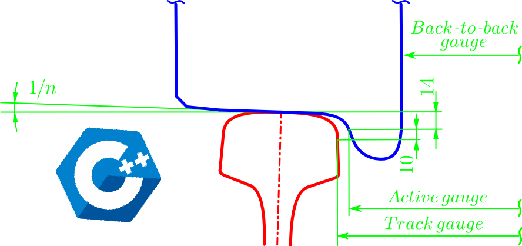
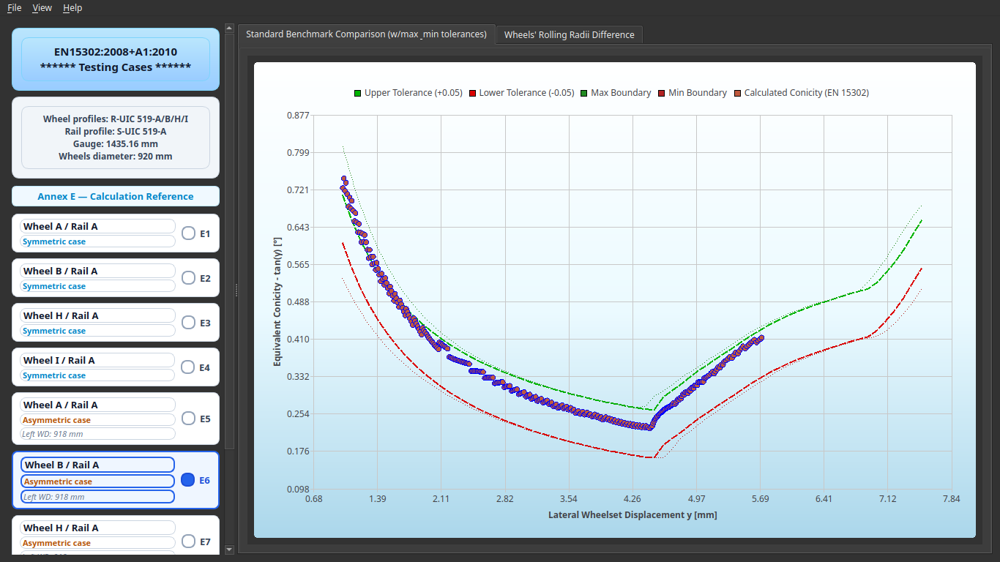
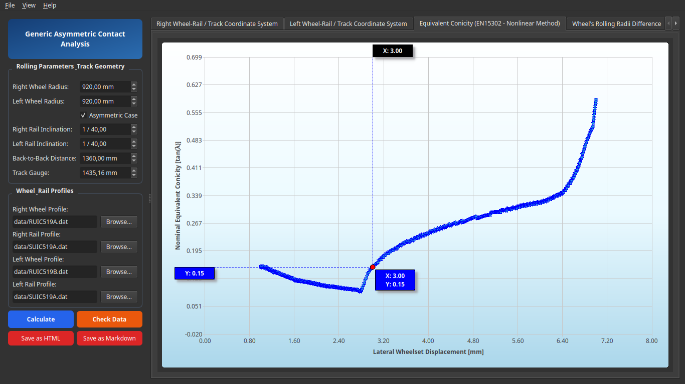
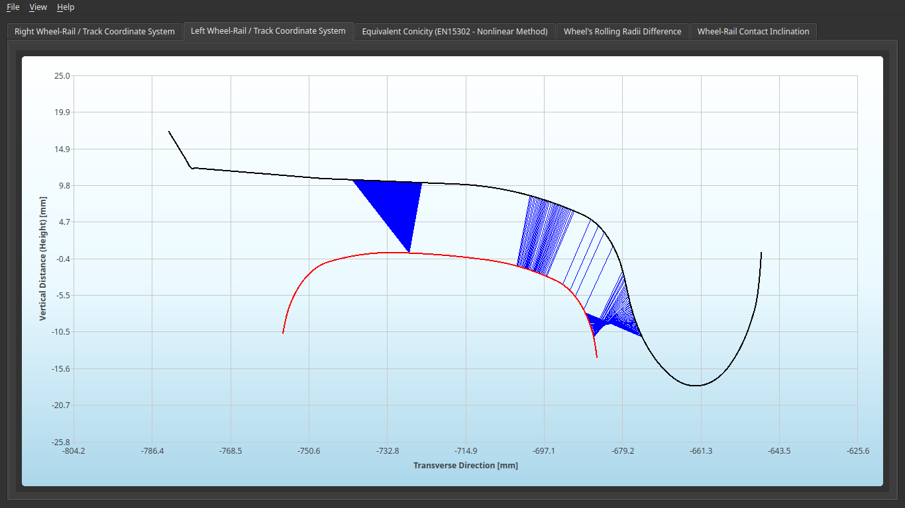
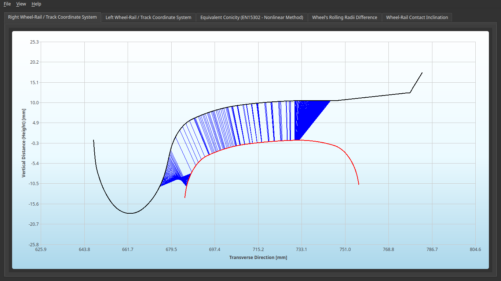
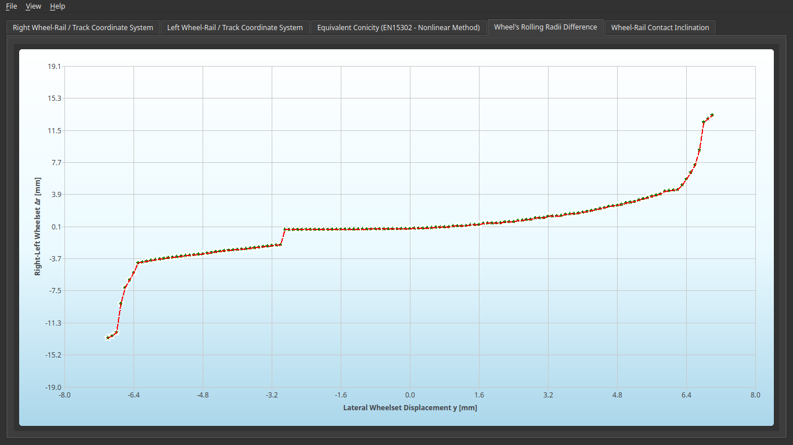
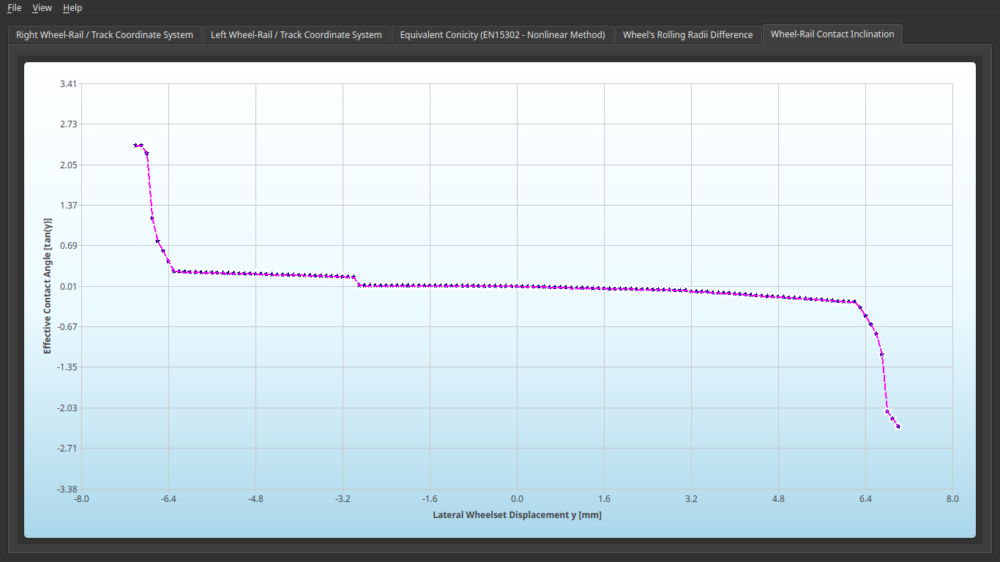
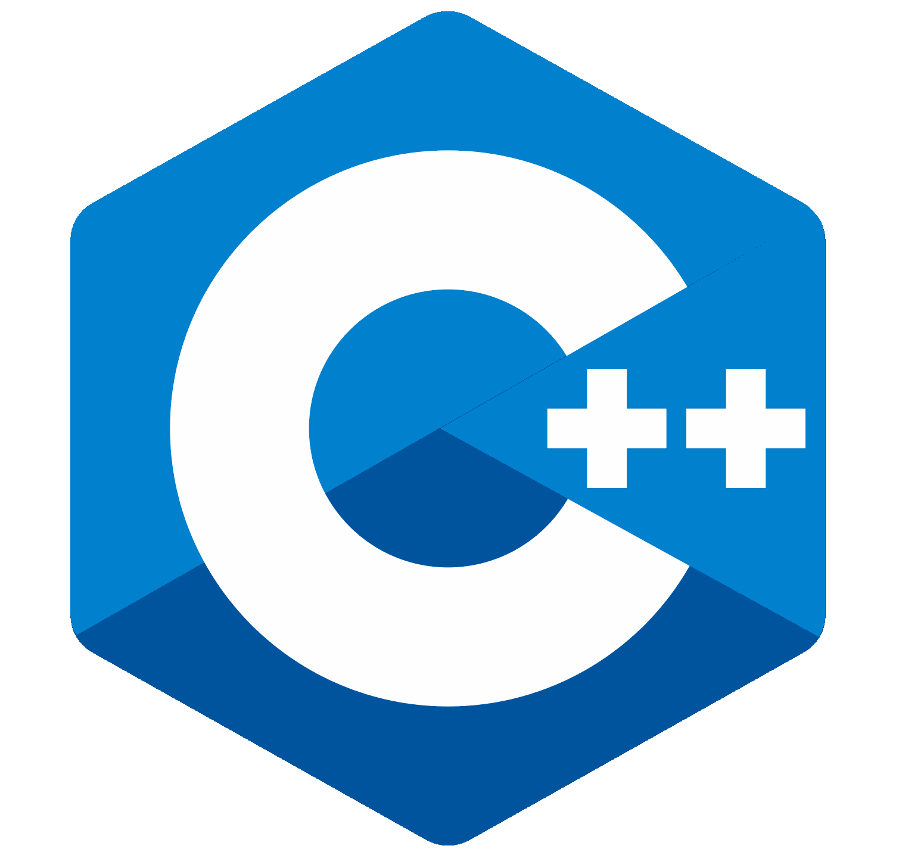
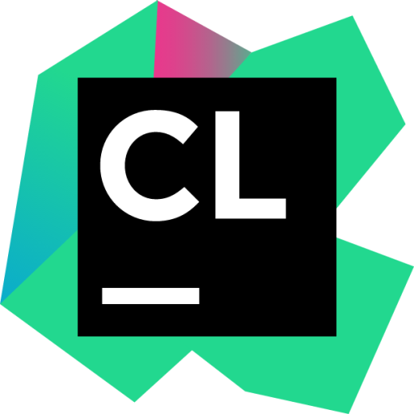

[![LinkedIn][linkedin-shield]][linkedin-url]

<!-- PROJECT LOGO -->

  
  <h3 align="center">Railway applications &#x300A; A &#x300B;</h3>
  

    <b>Wheel / Rail Contact Characterization Program</b>
  

## About the project

  

The software capabilities focus on the characterization of wheel-rail rigid contact through the aid of the following specific calculations:

- [x] `Potential wheel-rail contact points detection.`
- [x] `Contact angle tan(γa).`
- [x] `Rolling-radius difference ∆r function.`
- [x] `Equivalent conicity tan(γc)=f(λ).`

Now featuring a complete **Qt6 GUI** for contact analysis with interactive visualization, benchmark verification and comprehensive report generation.

### App window samples

|                   |            |
|:--------------------------------------------------------------------------------:|:--------------------------------------------------------------------------------------:|
|       |           |
|  |  |

> For the EN15302 Standard scope & detailed computing processes aspects, please visit the [original JavaFx version][WRCC_java-url].
>   

## Personal thoughts

  

* `Why C++?:` std library is actually powerful, perhaps the most (I still like Java, as well).

* `Why this repo?:` to provide an example of a coded solution to a real engineering problem.

* `Ok, and what else?:` it's also an excellent hands-on opportunity to get to work on modern std library and modern Qt6 C++ framework.
  
  

  

    :muscle: don't let anyone get you down :muscle:
  
 
  

## Built With

    
    
    

### Additional info

* Tested on Ubuntu 24.04 LTS & MS Windows 11.
* Standard template library features up to C++23.
* Modern **Qt6 GUI** integration powered by a [custom Qt Charts library][custom_charts-url] with interactive tracking, zooming and panning view capabilities.
* Added benchmark calculation comparing results against EN 15302 reference cases (E1 to E9).
* Automated Technical Report generation exporting formatted [HTML reports](docs/) and [high-resolution chart images](docs/figures).
* Heavy use of smart pointers for the sake of design simplicity and robust memory management.
* Improved mathematical curves definition using monotone cubic Hermite interpolator with PCHIP (Fritsch–Carlson) slope construction.

<!-- LICENSE -->

## License

- User interface distributed under the GPL-3.0 License. See [GUI-LICENSE.txt][gui-license-url] for more information.
- Calculation libraries distributed under the MIT License. See [LIB-LICENSE.txt][lib-license-url] for more information.

<!-- MARKDOWN LINKS & IMAGES -->

<!-- https://www.markdownguide.org/basic-syntax/#reference-style-links -->

[linkedin-shield]: docs/repo_figs/LinkedIn_logo_small.png
[linkedin-url]: https://www.linkedin.com/in/criogenox/
[WRCC_java-url]: https://github.com/criogenox/A_WRCC-Wheel-Rail-Contact-Characterization
[custom_charts-url]: https://github.com/criogenox/Custom-Zooming-and-Tracking-for-Charts-using-Pure-Qt
[gui-license-url]: https://github.com/criogenox/A_WRCC-Cpp-library-version_plot-capabilities?tab=GPL-3.0-1-ov-file
[lib-license-url]: https://github.com/criogenox/A_WRCC-Cpp-library-version_plot-capabilities?tab=MIT-2-ov-file
